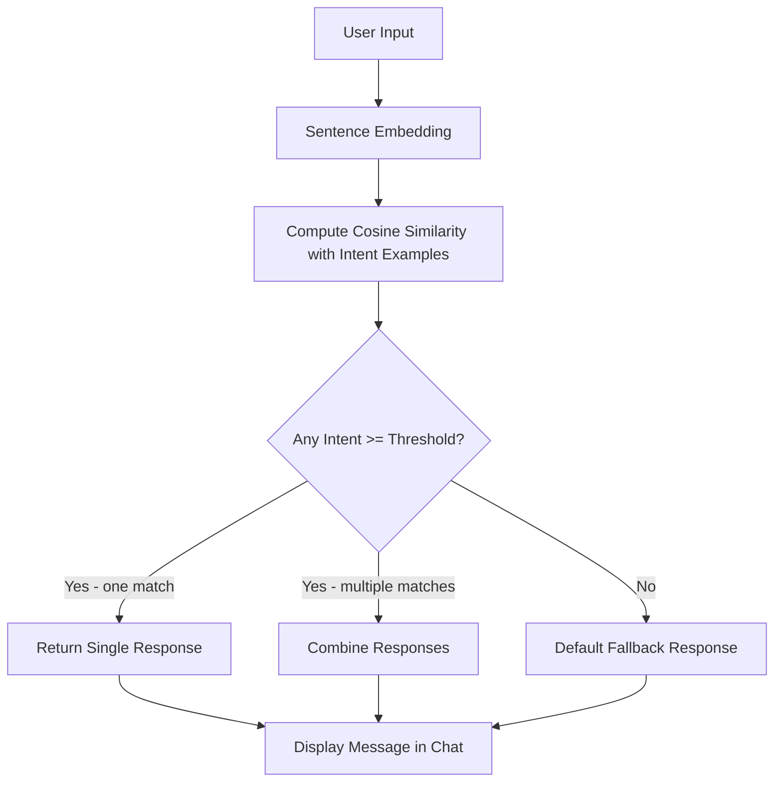
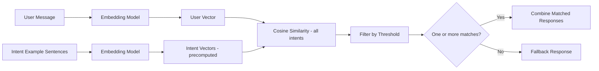

# 💬 Fitness AI Chatbot

A hybrid AI chatbot for fitness guidance that uses semantic embeddings to detect user intent, confidence scoring for unknown inputs, and dynamic next-step suggestions for interactive conversations.

This project demonstrates how modern chatbots work while keeping responses controlled for research and demo purposes.

---

## 🔹 Features

- Semantic intent detection using Sentence Embeddings
- **Multi-intent detection** — combined questions like "I want to work out and eat better" match and respond to both topics
- Adjustable confidence threshold via a sidebar slider — tune it live to see how it affects matching
- Next-step suggestions to guide users
- Structured, detailed responses for workouts, nutrition, sleep, cardio, and motivation

---

## 🏗️ Chatbot Architecture



---

## 🔹 How It Works

1. **User Input → Embedding:** Converts the user message into a semantic vector using `all-MiniLM-L6-v2`.
2. **Similarity Comparison:** Compares the user vector against precomputed example vectors for every intent using cosine similarity.
3. **Multi-Intent Matching:** All intents whose top similarity score meets the threshold are collected — not just the single best match. This allows questions like *"I need workout and nutrition advice"* to return both responses.
4. **Confidence Threshold:** Controlled via a sidebar slider (default: 0.6). Below the threshold, the bot responds with a helpful fallback that lists supported topics.
5. **Next-Step Suggestions:** Aggregated from all matched intents and deduplicated, so the user always gets relevant follow-up prompts.

---

## 🔹 Detailed Intent System



---

## 📌 Example Conversations

| User | Bot |
|------|-----|
| I want to build muscle | 💪 Returns full 3-day workout plan with table |
| I need sleep tips | 😴 Returns structured sleep advice |
| I want to work out and eat better | 💪🥗 Returns **both** workout and nutrition responses |
| Tell me about quantum physics | 🤔 Fallback with list of supported topics |

---

## 🖥️ Running the Chatbot

1. Clone this repository:
```bash
git clone <your-repo-url>
cd <repo-folder>
```

2. (Option A) Use the included virtual environment (recommended):
```bash
cd "/Users/milliontirfe/Desktop/Semantic Intent Chatbot"
source venv/bin/activate
streamlit run SemanticCoach.py
```

3. (Option B) Install dependencies globally instead:
```bash
pip install streamlit sentence-transformers scikit-learn
streamlit run SemanticCoach.py
```

4. Interact with the chatbot in your browser. Use the **sidebar slider** to tune the confidence threshold live.

---

## 🔹 Key Learnings

Building this taught me more than I expected, especially where my initial assumptions were wrong.

**Semantic embeddings beat keyword matching — but not automatically.** I assumed that swapping in `sentence-transformers` would just work out of the box. What I found is that the quality of your *example phrases* matters just as much as the model. Vague or overlapping examples caused the wrong intent to match, and I had to deliberately craft distinct, representative phrases for each topic before similarity scores became reliable.

**The confidence threshold is a real design decision, not a magic number.** I originally hardcoded `0.6` and moved on. But when I started testing edge cases, I realized a threshold that works well for broad questions is too loose for ambiguous ones, and too strict a threshold silences perfectly valid inputs. Exposing it as a slider made this concrete — I could watch matches appear and disappear in real time and understand *why* a value of 0.55 vs 0.65 changes the bot's behavior.

**Multi-intent turned out to be simpler than I thought, and more useful than I expected.** My original approach of returning only the top match felt like a reasonable simplification. But once I tested it with natural combined questions ("I want to work out and eat better"), it was obvious that dropping the second intent made the bot feel dumb. Switching from "find the best match" to "find all matches above threshold" was a small code change with a disproportionate improvement in how natural the conversations felt.

**Structured responses make the bot feel dramatically more useful.** The original one-liner responses were fine for a proof of concept, but when I replaced them with tables and bullet points, the same underlying logic felt like a different product. The bot didn't get smarter — the presentation just stopped underselling what it knew.

**Rule-based systems have a clear ceiling, and hitting it is instructive.** There were questions I couldn't make this bot handle well no matter how many example phrases I added — anything that required follow-up context, personalisation, or reasoning across turns. That ceiling is useful to understand: it's what motivates moving toward LLM-backed responses, memory, or retrieval-augmented generation in future iterations.
